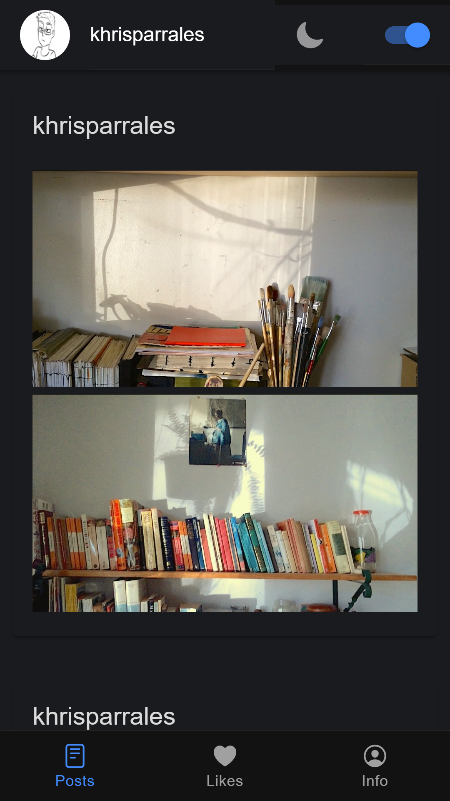
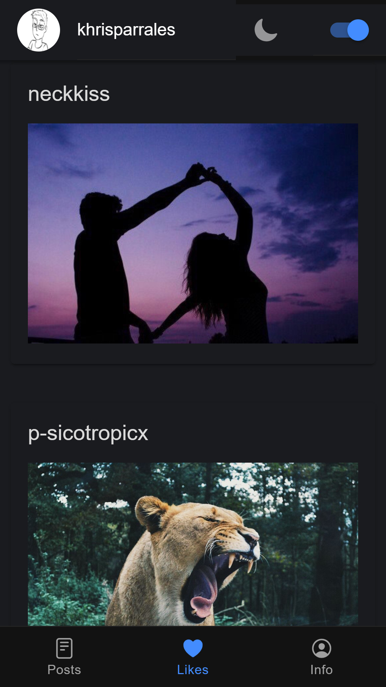
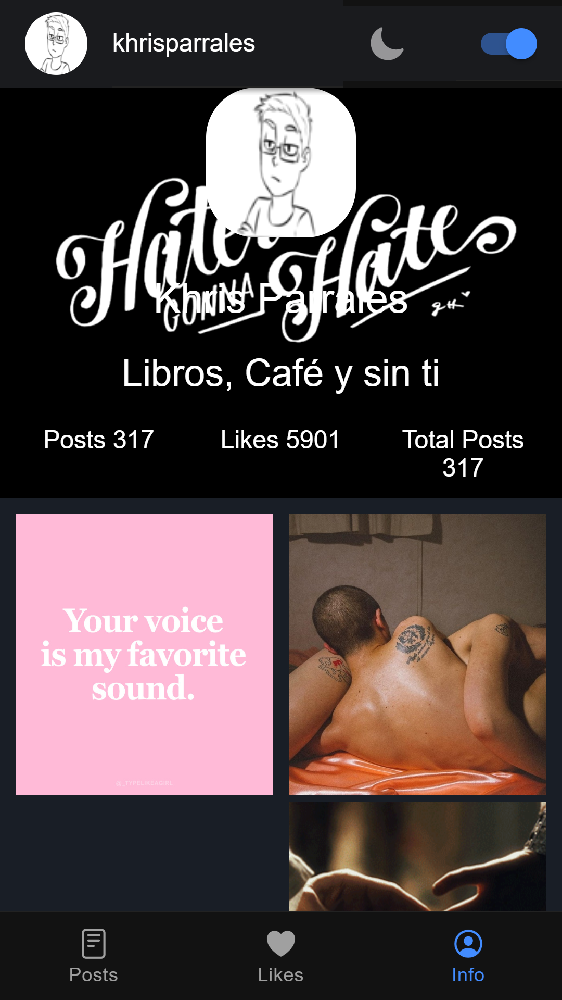
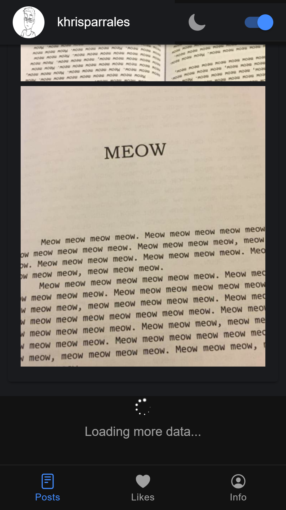
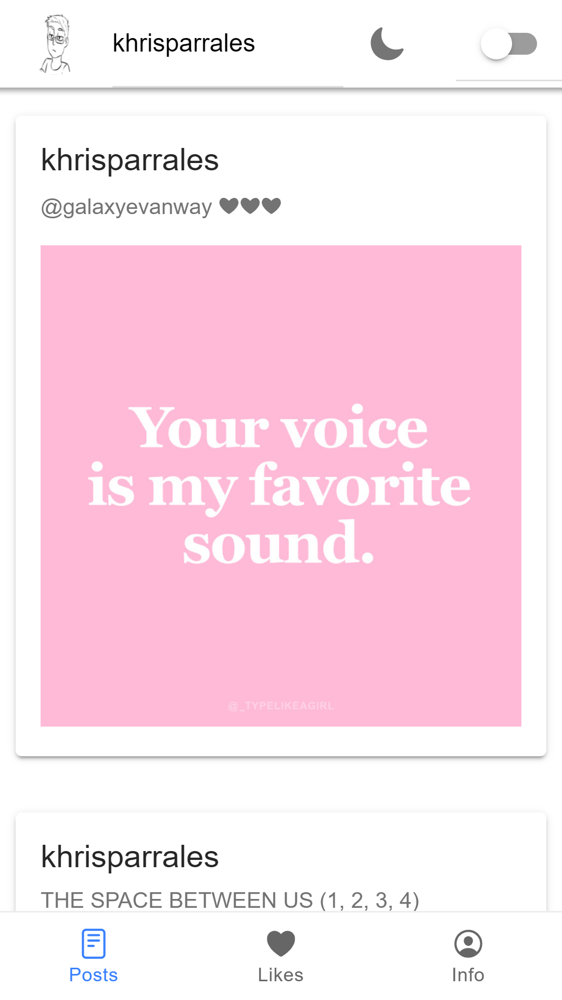
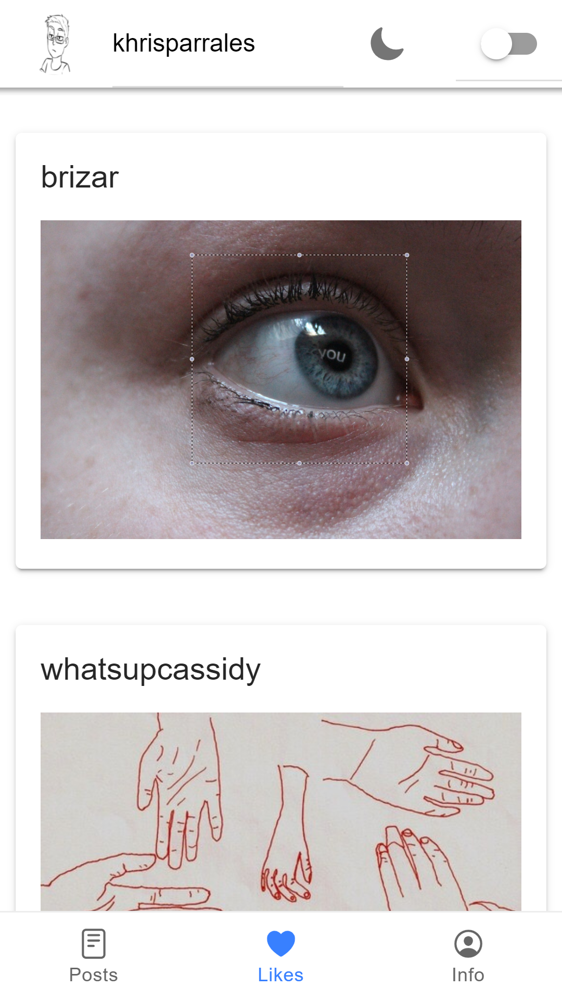
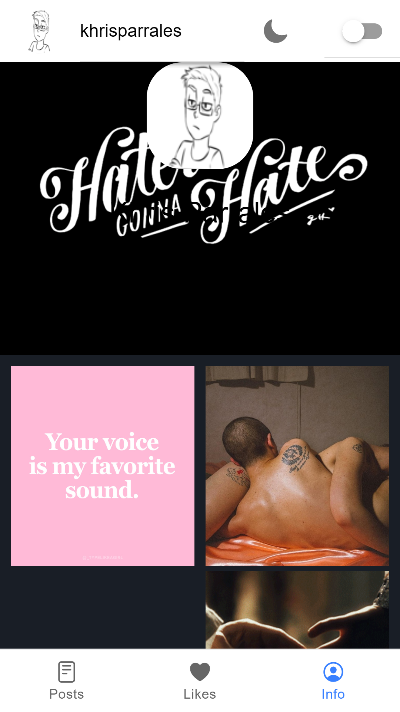

# Ionic-Tumblr-API
Proyecto de **Ionic 5** usando la **API**  de ***Tumblr*** y el **localstorage** para guardar la selección de **modo oscuro** del usuario, con tabs de:
- Posts del usuario.
- likes con posts que el usuario le diera like. 
- info con el avatar, poster y datos del Tumblr del Usuario.
### Capturas

> Agrega tu apikey y el nombre del usuario en las variables de environment.
<!--  -->
<!-- | Command | Description |
| --- | --- |
| git status | List all new or modified files |
| git diff | Show file differences that haven't been staged | -->